# WRO Future Engineers 2026 - Team Nova
This repository contains the software and documentation developed for an autonomous vehicle designed to compete in the WRO Future Engineers 2026 competition.

The project focuses on autonomous navigation, obstacle detection, trajectory planning, and real-time decision-making. The vehicle is designed to interpret sensor data from its environment and use this information to determine and execute appropriate movements throughout the competition field.

## Parners
<table align="center" cellspacing="12">
<tr>
  <td bgcolor="#ffffff" align="center" width="200">
    
  </td>
  <td bgcolor="#ffffff" align="center" width="200">
    
  </td>
  <td bgcolor="#ffffff" align="center" width="200">
    
</tr>


## Project Overview

The autonomous system integrates sensor processing, vehicle control, and navigation algorithms to achieve reliable and precise movement. The software continuously processes information from the vehicle's sensors and adjusts its trajectory according to the detected conditions.

The main objectives of the system are:

 - Autonomous navigation of the competition field.
 - Detection and avoidance of obstacles.
 - Real-time trajectory planning and adjustment.
 - Precise steering and motor control.
 - Reliable decision-making based on sensor data.
 - Autonomous execution of the required maneuvers.
 - Technical Approach

The project combines embedded programming, robotics, sensor integration, control systems, and computational geometry.

The navigation system uses sensor measurements to estimate the vehicle's position and identify relevant elements of the environment. Based on this information, the control algorithms determine the appropriate steering and movement commands required to follow the planned trajectory.

Special attention is given to reliability, repeatability, and adaptability, ensuring that the vehicle can operate under different configurations of the competition field.

## Repository Structure

The repository contains the source code and supporting resources required for the development and operation of the autonomous vehicle.

The code is organized to facilitate the development, testing, and modification of the different components of the autonomous system.

## Competition

World Robot Olympiad – Future Engineers 2026

This project is developed as part of our participation in the WRO Future Engineers category, with the objective of designing and implementing a reliable autonomous robotic system capable of completing the competition challenges.

## Table of Contents
* [The Team](#team)
* [Robot Photos](#robot-image)
* [Mobility Management](#mob-manager)
  * [Power Train](#power-train)
    * [Diferencial](#diferencial)
    * [Motor](#motor)
  * [Steering System](#steering-sis)
    * [Servo Motor](#servo-motor)
* [Others Electronics](#others)
  * [RCU](#rcu)
  * [Ultrasonic Sensor](#utra-sensor)
  * [AI CAM](#aicam)
* [Python Code](#py-code)
  * [Libraries and Variables](#py-lib-variables)
  * [PD Steering Control](#py-pd-control)
  * [Escape Maneuver](#py-escape-Maneuver)
  * [Main Control System](#py-main-control)
  * [Object Detection and Navigation](#py-objdetec)
  * [Starting the Program](#py-starting-code)  
* [Robocode Block Code](#block-code)
  * [B PD Steering Control](#block-pd-control)
  * [B Escape Maneuver](#block-escape-maneuver)
  * [B Main System Setup and Sensor Reading](#block-main)
  * [B Object Detection and Robot Navigation](#block-objdetec-final)

## The Team <a class="anchor" id="team"></a>

### Juan Andrés Guerra
<p align="center">
  
</p>

<b>High School:</b> Windsor School, Valledupar, Colombia

---

### Angel Valeria Ruiz

<p align="center">
  
</p>

<b>High School:</b> Ciberkids, Valledupar, Colombia

---

### Team Photo
<p align="center">
  
</p>

## Vehicle's photos <a class="anchor" id="robot-image"></a>

| 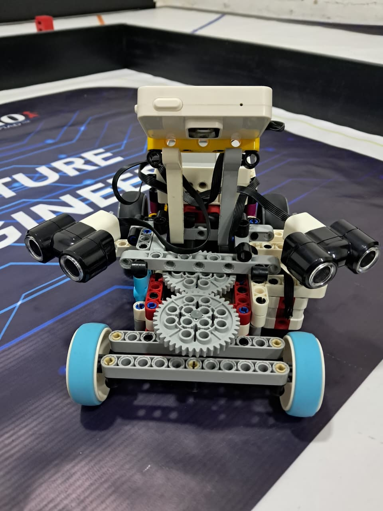 | 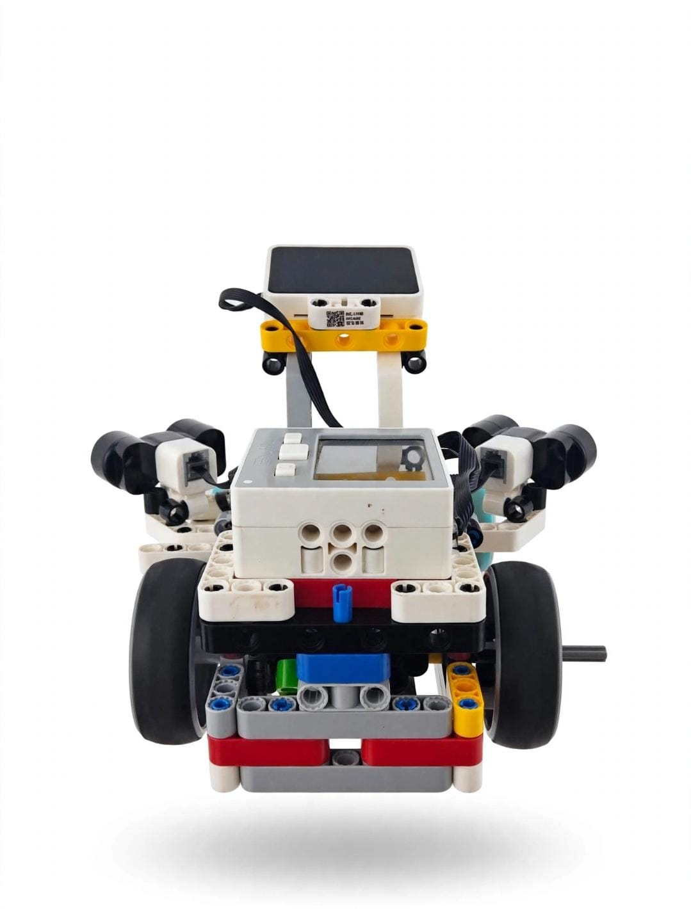 | 
| :--: | :--: | 
| *Front* | *Back* |
| 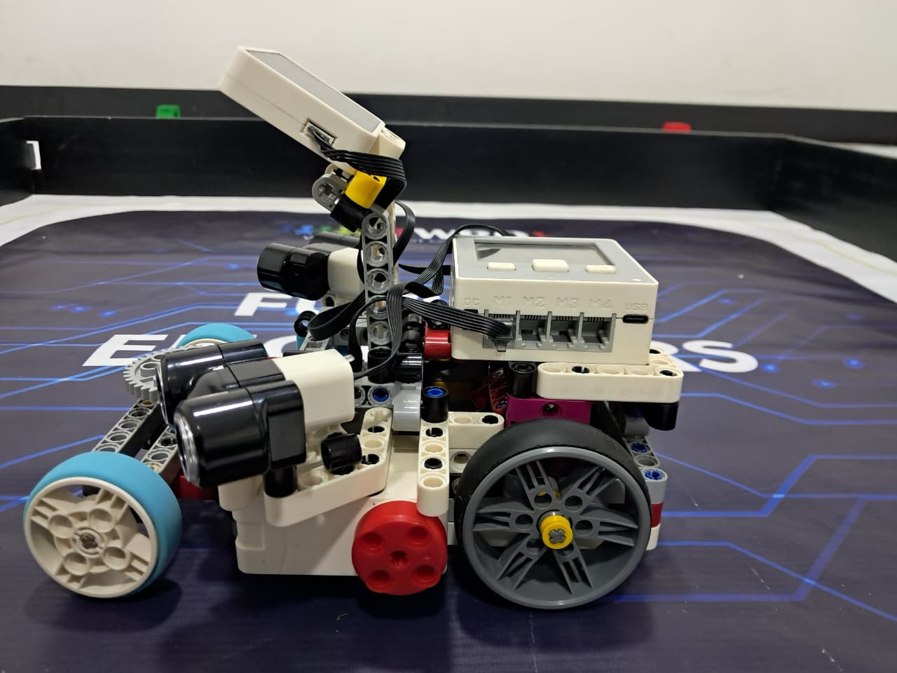 | 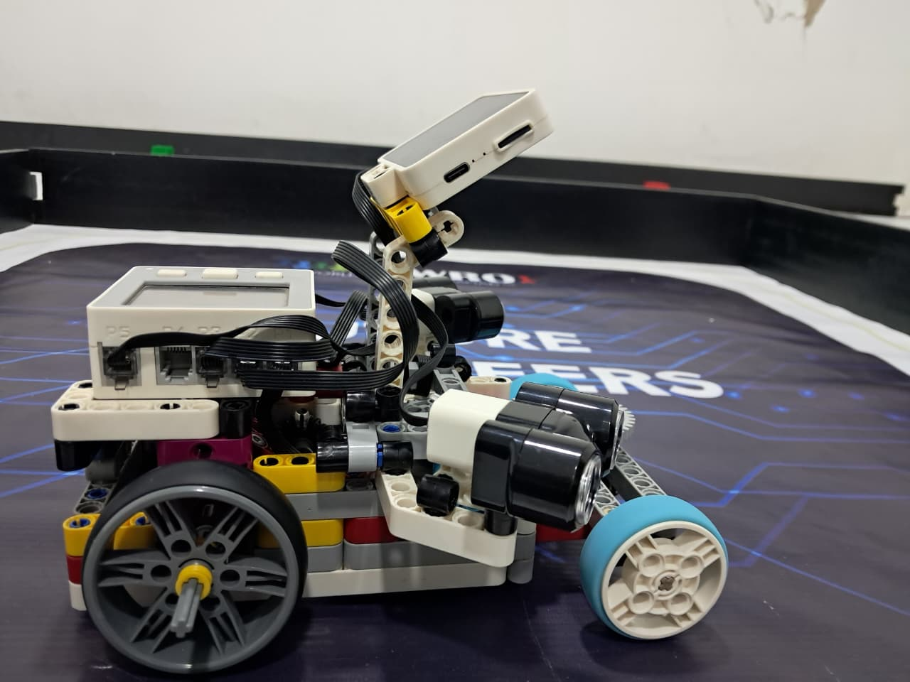 | 
| *Left* | *Right* |
| 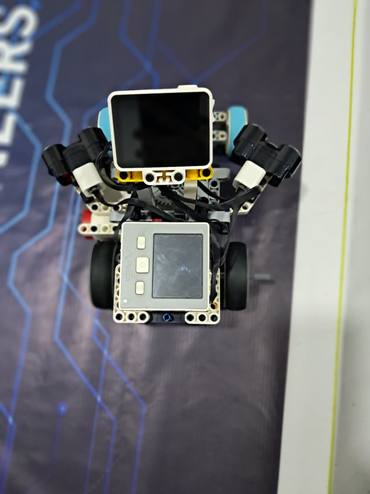 | 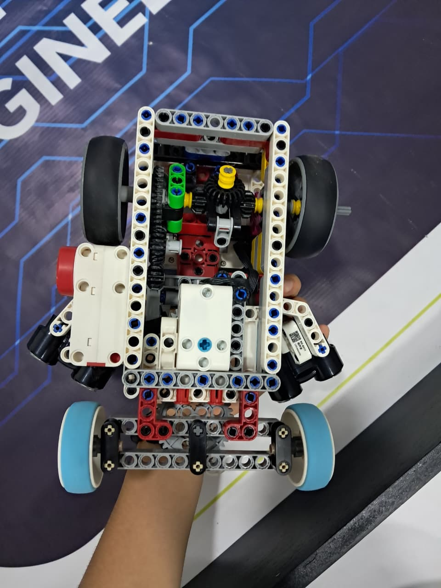 | 
| *Top* | *Bottom* |

# Mobility Management <a class="anchor" id="mob-manager"></a>
The robot's mobility is managed by a combination of components, including the powertrain and steering system. These elements work together to ensure the robot's smooth and efficient movement.

## Power Train <a class="anchor" id="power-train"></a>

### Diferencial <a class="anchor" id="diferencial"></a>
This differential was built using LEGO Technic components and is designed to transmit power from the drivetrain to both wheels while allowing them to rotate at different speeds.

**How it was built:**
The differential consists of a central gear mechanism enclosed within a rigid LEGO Technic frame. The main drive gear transfers rotational power into the differential housing, while a set of bevel gears inside the mechanism distributes the rotation between the two wheel axles. The axles are connected to the left and right wheels, allowing the system to transfer torque to both sides.

**How it works:**
When the vehicle moves in a straight line, both wheels rotate at approximately the same speed. When the vehicle turns, the outer wheel needs to travel a greater distance than the inner wheel. The bevel gears inside the differential allow the two output axles to rotate at different speeds while still receiving power from the drivetrain. This reduces wheel slipping and makes the vehicle turn more smoothly.

</p>
<p align="center">
  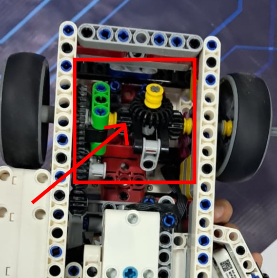
</p>

In simple terms, the differential splits the drivetrain's power between the two wheels while allowing each wheel to rotate at the appropriate speed during a turn.

**Key features**
* Transfers power to both wheels.
* Allows different rotational speeds between the wheels.
* Improves turning performance.
* Reduces tire slipping during turns.
* Built entirely with LEGO Technic gears, axles, and structural elements.

### Motor <a class="anchor" id="motor"></a>
**Medium Geared Motor 7.4V with Encoder**
The ZMROBO Medium Geared Motor (JMP-BE-3579A) is a power component designed for robotic applications. It provides controlled rotational movement and is used to drive the vehicle's drivetrain.

**How it works:**
The motor receives control signals from the main controller and can rotate clockwise, counterclockwise, or stop/brake. Its speed can be adjusted across 100 levels, allowing precise control of the vehicle's movement.
The motor includes a built-in encoder, which provides feedback about the motor's rotation. This allows the controller to monitor and precisely control the motor's movement.

</p>
<p align="center">
  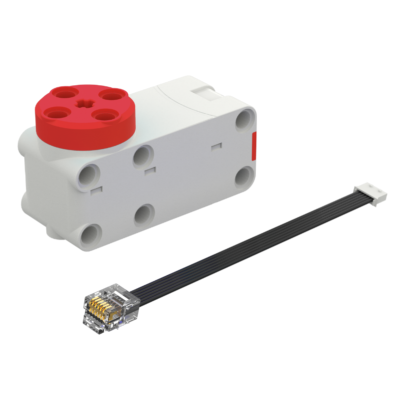
</p>

</p>
<p align="center">
  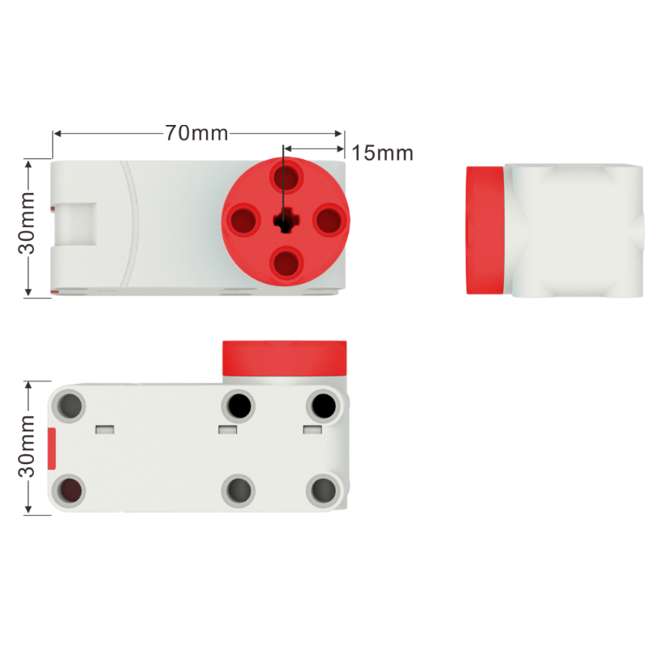
</p>

**Specifications**
* Model: JMP-BE-3579A
* Type: Medium Geared Motor with Encoder
* Voltage range: 3.0–4.2 V DC
* Rated voltage: 3.7 V
* No-load current: ≤130 mA
* No-load speed: 132 RPM ±10%
* Stalling current: ≤1.5 A
* Stalling torque: ≥1.8 kgf·cm
* Connector: Standard 1.25 mm connector
* Encoder: Built-in encoder
* Speed control: 100 adjustable levels
* Rotation: Clockwise and counterclockwise
* Braking: Supported

**Role in the Vehicle:**
The motor acts as the main source of mechanical power. Its output rotation is transferred through the gear system to the drivetrain and differential, which then distributes the motion to the wheels. The encoder allows the controller to obtain rotational feedback, making it possible to achieve more accurate speed and movement control.

## Steering System <a class="anchor" id="steering-sis"></a>
The steering system is designed to control the direction of the vehicle by turning the front wheels. The system uses a Mini Servo connected to a gear mechanism that transfers the servo's movement to the steering linkage.

**How it was built**
The steering system consists of a Mini Servo, a series of gears, a steering shaft, and a mechanical linkage connected to the front wheels. The servo is mounted securely inside the vehicle's structure, while its output is connected to the gear system.
The gears transmit the servo's rotation to the steering mechanism. The final gear is connected to the steering linkage, which moves the front wheels to the left or right.

**How it works**
When the controller sends a signal to the Mini Servo, the servo rotates to a specific position. This rotation is transferred through the gears, which convert the servo's movement into the required steering motion.
As the gear mechanism rotates, it moves the steering linkage and changes the angle of the front wheels. By controlling the servo position, the vehicle can steer left, right, or return to its central position.
The gear system also provides mechanical transmission and control, allowing the relatively small movement of the servo to be effectively transferred to the steering mechanism.
</p>
<p align="center">
  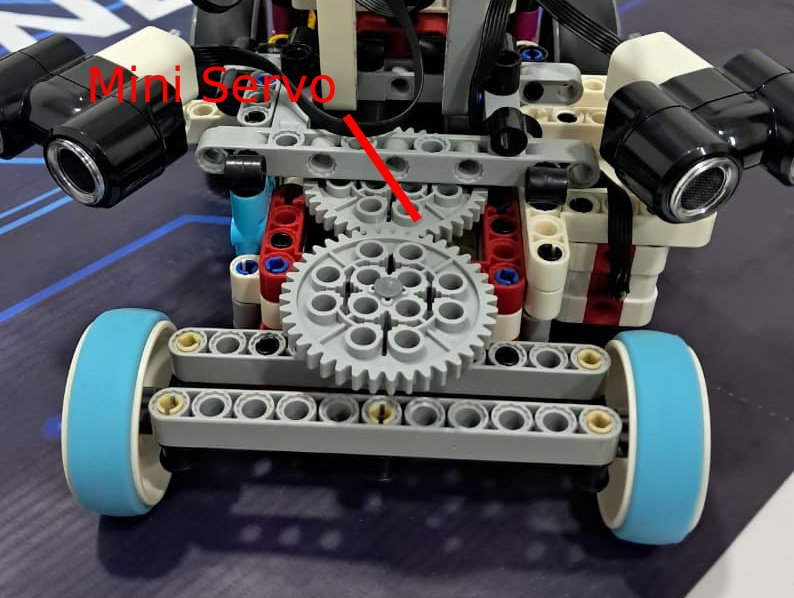
</p>

**Key Features**
* Uses a ZMROBO Mini Servo for steering control.
* Gear mechanism transfers the servo's rotation to the steering linkage.
* Allows the front wheels to turn left and right.
* Provides controlled and precise steering movement.
* The structure keeps the steering mechanism securely aligned.
* The servo can return the wheels to a centered position when required.

### Servo Motor <a class="anchor" id="servo-motor"></a>
The **ZMROBO Mini Servo** is an integrated servo unit that combines motor control, servo drive, and bus communication in a single device. It is mainly designed for micro-robot applications such as joint, wheel, and track driving, while also providing precise position and angle control.

**How it works**
The servo receives commands from the robot's controller through its communication interface and rotates its output shaft to the requested position. Its 0–359° operating range allows almost a full rotation, while the built-in control system provides precise positioning with an accuracy of ≤1°.
In the steering system, the servo's output shaft is connected to a gear mechanism. When the servo rotates, the gears transfer its movement to the steering linkage, causing the front wheels to change direction.

</p>
<p align="center">
  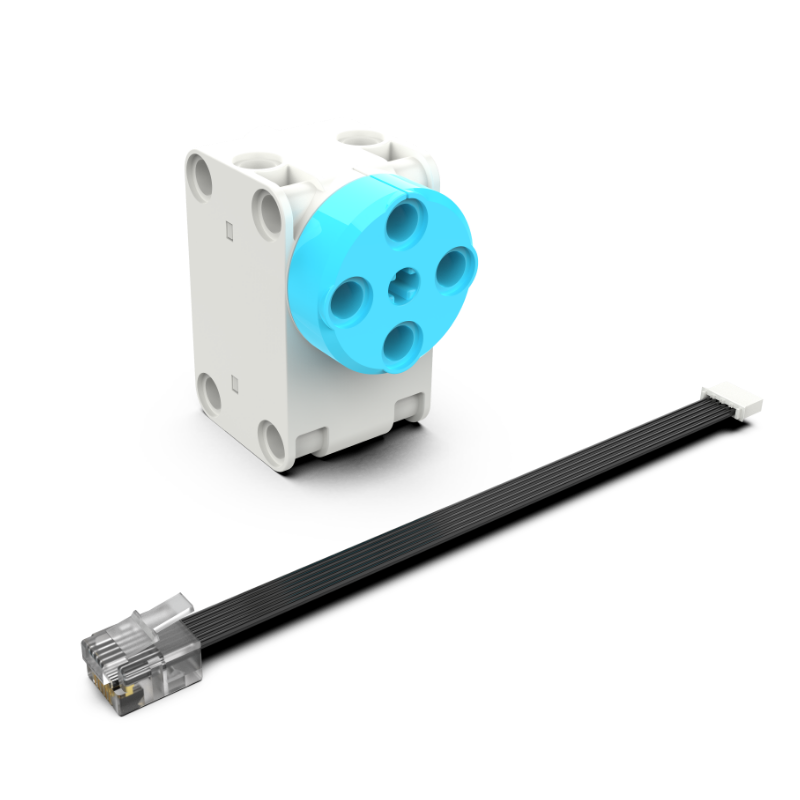
</p>

</p>
<p align="center">
  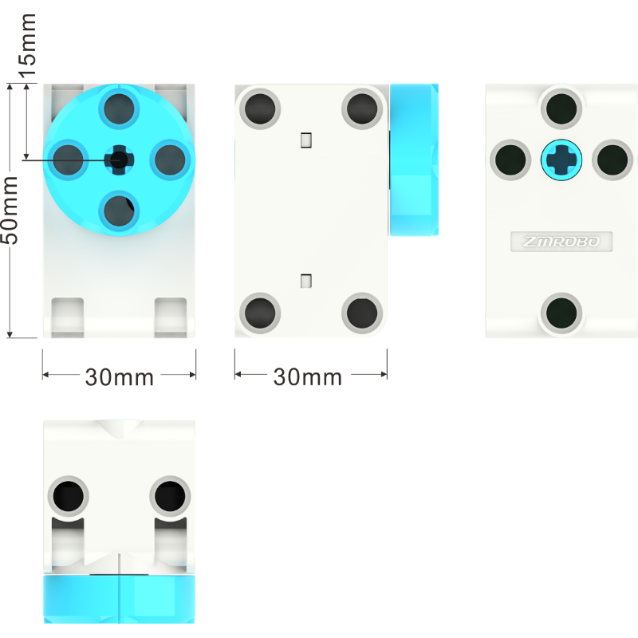
</p>

**Specifications**
* Voltage range: 5–9 V DC
* Operating angle: 0–359°
* Positioning accuracy: ≤1°
* Maximum speed: ≤0.2 sec/60°
* Maximum torque: ≥8 kgf·cm at 5 V
* Gear system: High-precision metal gears
* Bearings: Double ball bearings
* Communication: Built-in bus communication interface
* Control: Integrated motor control and servo drive
* Role in the Steering System

The servo acts as the main actuator of the steering system. It converts electrical commands from the controller into precise rotational movement, which is then transmitted through the gears to the steering mechanism. Its high positioning accuracy and strong torque allow the front wheels to be controlled reliably.
This combination of precise positioning, metal gears, and double ball bearings makes the servo suitable for accurate and responsive steering in the robot.

## Others Electronics <a class="anchor" id="others"></a>
This section provides **detailed information about the electronic components used in the robot and their role within the overall system**. Each component performs a specific function, allowing the robot to perceive its environment, process information, and interact with the user.
Overall, this section explains the **purpose, specifications, communication, and integration of each electronic component**, providing a clear understanding of how they work together as part of the robotic system.

### RCU Controller <a class="anchor" id="rcu"></a>
The **M6 RCU controller** acts as the central unit of the robot. It receives information from the sensors and camera, processes the available data, and sends commands to the motors and servo systems. This allows the robot to coordinate its movement and respond to changes in its environment.

</p>
<p align="center">
  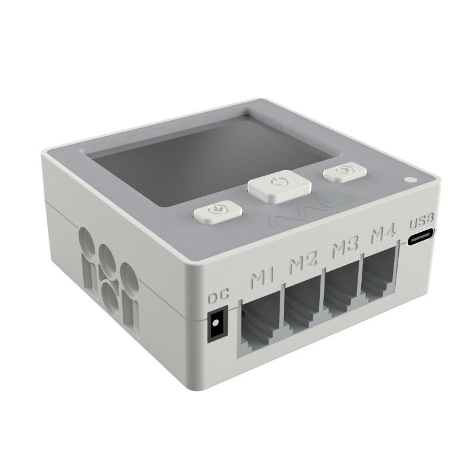
</p>

**Functions:**
* C6-RCU is powered by a lithium battery or an external circuit and supplies power to sensors or motors through a connection cable.
* It has a storage function and compiled programs can be downloaded to the controller.
* It can execute compiled programs online or offline and transmit working signals to sensors or motors at different ports.
* It has a built-in Bluetooth module, sound sensor, and buzzer.

### Ultrasonic Sensor <a class="anchor" id="ultra-sensor"></a>
The **ZMROBO Ultrasonic Sensors** allow the robot to detect objects and estimate distances, which is essential for obstacle detection and navigation.

</p>
<p align="center">
  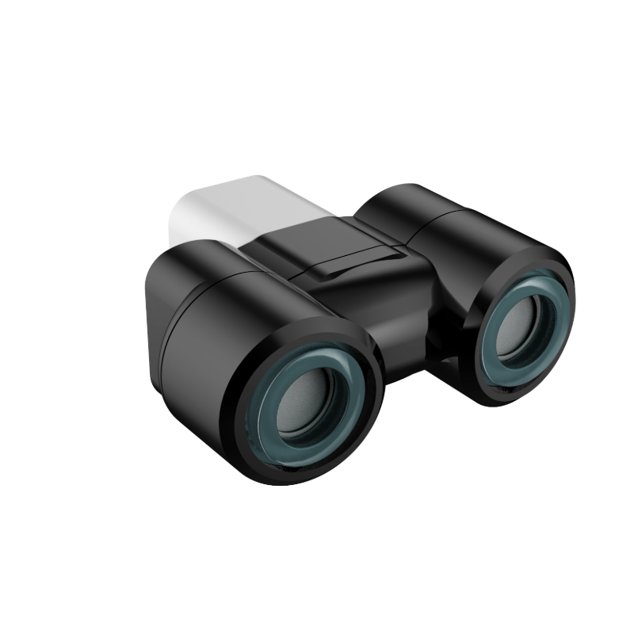
</p>

**Function:**
* Determine the distance by transmitting an ultrasonic signal and receiving an ultrasonic signal reflected by the ranging object.

**Parameters:**
* Standard ZMROBO RCU universal telephone line interface
* Working voltage 5V
* Detection distance 5-200CM, accuracy 1CM
* Built-in two full-color LED lights for custom colors.

### AI CAM <a class="anchor" id="aicam"></a>
The **ZMROBO AI CAM (AI Vision Module V2.0)** is a Built-in Al algorithms and zero-code Al access make smart creation effortless.

</p>
<p align="center">
  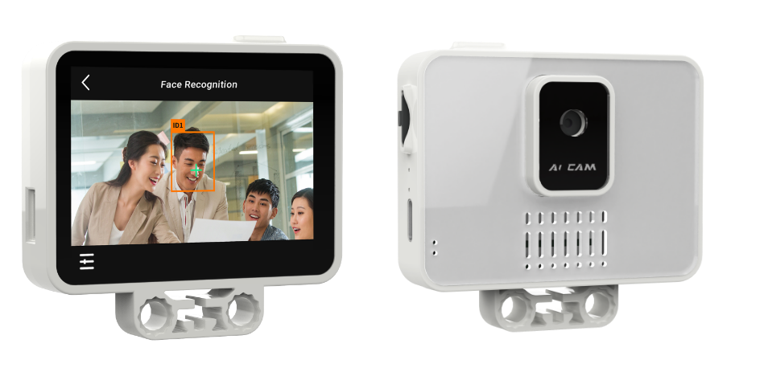
</p>

**Specifications**
* 2.4" Capacitive Touchscreen
* Speech Recognition
* Image Learning
* Vision Recognition
* Color Recognition
**And much more**

## Code Python <a class="anchor" id="py-code"></a>
This program controls an autonomous robot using an AI camera, ultrasonic sensors, a servo motor, and drive motors. The robot is designed to detect colored objects, adjust its direction according to their position, and avoid obstacles while moving through its environment.

### Libraries and Variables <a class="anchor" id="py-lib-variables"></a>

The program starts by importing the libraries needed to communicate with and control the different hardware components of the robot. It also defines several global variables that will store information such as detected objects, sensor measurements, steering angles, and the values required for the PD controller.
```ino
import rcu, aicam, servo, sensor, motor

var_ulti_error = 0
var_kp = 0
var_kd = 0
var_var_rojo = 0
var_var_verde = 0
var_id_obj = 0
var_x_coord = 0
var_height = 0
var_ultrasonico_1 = 0
var_ultrasonico_2 = 0
var_angulo = 0
var_error = 0
var_derivada = 0
var_giro = 0
var_angulo_seguro = 0
var_angulo_escape = 0
```
### PD Steering Control <a class="anchor" id="py-pd-control"></a>
The "calcular_angulo_pd()" function is responsible for determining how the robot should steer based on the position of the object detected by the AI camera. It calculates the difference between the object's current position and the desired position, then uses proportional and derivative values to create a smooth steering correction. The resulting angle is also limited to keep the servo within a safe range.
```ino
def calcular_angulo_pd(x_actual, x_objetivo):
    var_error = x_objetivo - x_actual
    var_derivada = var_error - var_ulti_error
    var_giro = (var_error * var_kp) + (var_derivada * var_kd)
    var_ulti_error = var_error
    var_angulo = 90 + var_giro

    if (var_angulo > 140):
        var_angulo_seguro = 140
    else:
        if (var_angulo < 40):
            var_angulo_seguro = 40
        else:
            var_angulo_seguro = var_angulo
```
### Escape Maneuver <a class="anchor" id="py-escape-maneuver"></a>
The "maniobra_escape()" function is designed to prevent the robot from colliding with nearby walls or obstacles. When an obstacle is detected, the robot stops and uses the distances measured by the ultrasonic sensors to determine the safest direction to turn. It then moves backward to create space before returning the servo to its central position.
```ino
def maniobra_escape(dist_derecha, dist_izquierda):
    motor.SetMotor(1, 0)
    rcu.SetWaitForTime(0.2)

    if (dist_izquierda < 100):
        var_angulo_escape = 140
    else:
        if (dist_derecha < 100):
            var_angulo_escape = 40
        else:
            var_angulo_escape = 90

    servo.SetMagneticServoDegreeSpeed(1, var_angulo_escape, 90)
    motor.SetMotor(1, -70)
    rcu.SetWaitForTime(1)

    servo.SetMagneticServoDegreeSpeed(1, 90, 90)
    motor.SetMotor(1, 0)
    rcu.SetWaitForTime(0.2)
```
### Main Control System <a class="anchor" id="py-main-control"></a>
The "task1()" function brings together all the main components of the robot and establishes their initial configuration. It sets the values for the PD controller, assigns identification numbers to the red and green objects, configures the AI camera for color detection, and places the servo in its starting position. After this setup, the robot continuously reads information from its camera and ultrasonic sensors.
```ino
def task1():
    var_ulti_error = 0
    var_kp = 0.08
    var_kd = 0.005

    var_var_rojo = 1
    var_var_verde = 2

    aicam.SetWaitAICamCmd(5, "color")
    servo.SetMagneticServoDegreeSpeed(1, 90, 70)

    while True:
        var_id_obj = aicam.GetAICam(5, 1, 1)
        var_x_coord = aicam.GetAICamIDData(5, 1, 1)
        var_height = aicam.GetAICamIDData(5, 1, 4)

        var_ultrasonico_1 = sensor.GetUltrasound(2)
        var_ultrasonico_2 = sensor.GetUltrasound(3)
```
### Object Detection and Navigation <a class="anchor" id="py-objdetec"></a>
This section contains the main decision-making logic of the robot. It first checks whether an obstacle is dangerously close and, if so, activates the escape maneuver. If the path is clear, the robot checks which color has been detected and uses the PD controller to adjust its steering. When no recognized color is detected, the robot continues moving forward with the servo centered while searching for a target.
```ino
if (((var_height > 250) or (var_ultrasonico_2 < 20)) or 
    (var_ultrasonico_1 < 20)):

    maniobra_escape(var_ultrasonico_2, var_ultrasonico_1)
    var_ulti_error = 0

else:
    if (var_id_obj == var_var_rojo):
        calcular_angulo_pd(var_x_coord, 90)
        servo.SetMagneticServoDegreeSpeed(1, var_angulo, 80)
        motor.SetMotor(1, 80)

    else:
        if (var_id_obj == var_var_verde):
            calcular_angulo_pd(var_x_coord, 520)
            servo.SetMagneticServoDegreeSpeed(1, var_angulo, 80)
            motor.SetMotor(1, 80)

        else:
            servo.SetMagneticServoDegreeSpeed(1, 90, 70)
            motor.SetMotor(1, 100)
            var_ulti_error = 0

    rcu.SetWaitForTime(0.05)
```
### Starting the Program <a class="anchor" id="py-starting-code"></a>
The final line calls the "task1()" function, which starts the entire control system. Once this function is executed, the robot begins its autonomous operation and continuously repeats the process of detecting objects, checking for obstacles, calculating steering corrections, and controlling its movement.
```ino
task1()
```
## Block Code <a class="anchor" id="block-code"></a>
This part uses RoboCode blocks to program an autonomous robot capable of detecting colored objects, adjusting its direction, and avoiding obstacles using ultrasonic sensors.
### PD Steering Control <a class="anchor" id="block-pd-control"></a>
The "calcular_angulo_pd" function controls the robot's steering according to the position of the detected object. It calculates the error between the current and target positions, then uses proportional and derivative control to determine the necessary steering correction. The final angle is limited between 40° and 140° to prevent excessive turns.

<b>Block code:</b>

<p align="center">
  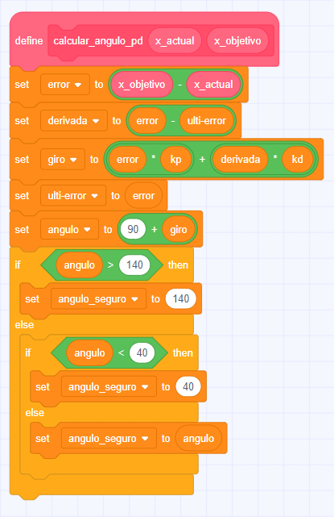
</p>

---

### Escape Maneuver <a class="anchor" id="block-escape-maneuver"></a>
The "maniobra_escape" function is responsible for preventing collisions with walls or obstacles. The robot first stops and checks the distance detected by the ultrasonic sensors. Depending on which side is closer to an obstacle, it chooses a direction to turn, moves backward, and finally returns the servo to the center.

<b>Block code:</b>

<p align="center">
  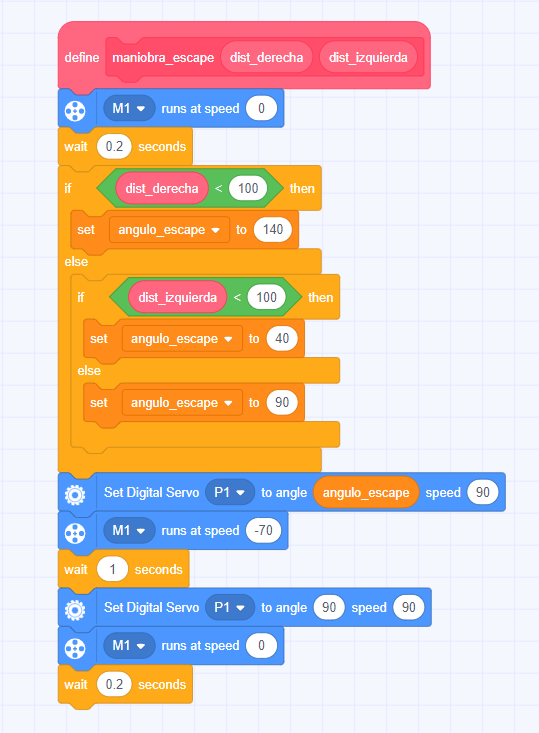
</p>

---

### Main System Setup and Sensor Reading <a class="anchor" id="block-main"></a>
The "task1" function initializes the main parameters of the robot, including the PD controller values and the IDs assigned to the red and green objects. It also configures the AI camera for color recognition and centers the servo before starting the main loop. During the loop, the robot continuously receives information from the AI camera and ultrasonic sensors.

<b>Block code:</b>

<p align="center">
  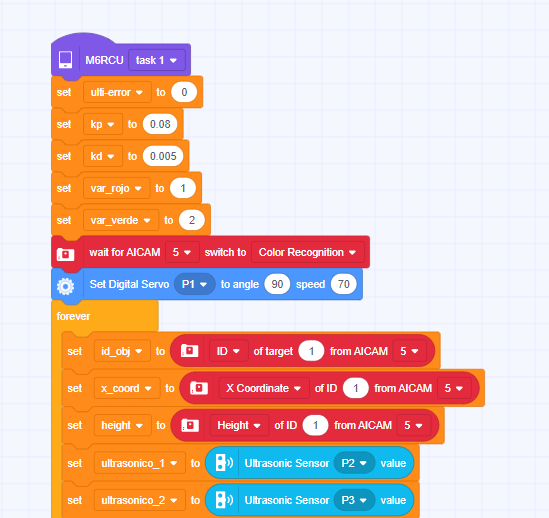
</p>

---

### Object Detection and Robot Navigation <a class="anchor" id="block-objdetec-final"></a>
This section contains the main decision-making process of the robot. It checks whether an obstacle is too close and activates the escape maneuver when necessary. If the path is clear, the robot identifies whether the detected object is red or green and uses the PD controller to adjust its direction. If no recognized object is detected, the robot continues moving forward with the servo centered. The robot continuously repeats the detection and navigation process. A short delay of 0.05 seconds is used between cycles, allowing the sensors and AI camera to update their information while maintaining continuous movement.

<p align="center">
  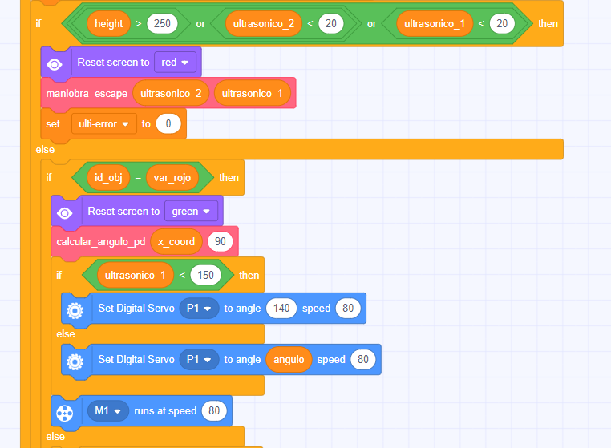
</p>
<p align="center">
  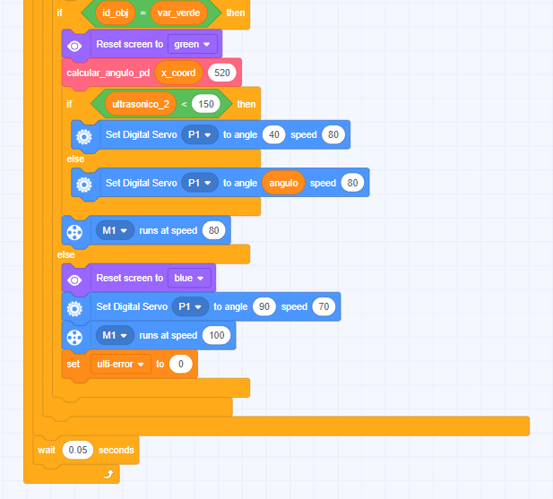
</p>
